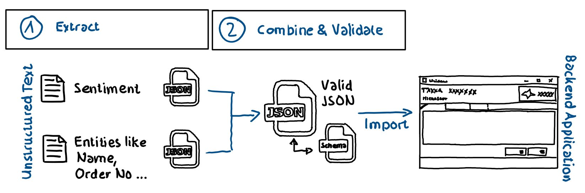

# Chaining prompts with native code

## Repo Content

The repo contains a c# [end-to-end sample](./src/README.md) to chain semantic functions (LLM prompts) and native functions (.NET code) using [MS Semantic Kernel](https://learn.microsoft.com/en-us/semantic-kernel/overview/). Sentiment and entities from free text are identified and extracted using LLMs (GPT-35-turbo) and provided as JSON information. .NET code is used to combine both JSON strings into a single JSON which is validated against a JSON schema.

The necessary Azure environment to run the sample can be created using the provided [Azure CLI script](./src/CreateEnv/CreateEnv.azcli).

## Scenario

Existing unstructured data from various sources (call transcriptions, mails etc.) should be analyzed in terms of sentiment and entities such as name, location, order number etc. The information should be extracted and imported in an existing backend system for further processing. The backend system expects JSON validated against an existing JSON schema.



## Chaining LLM prompts with native .NET functions

LLMs like GPT can be used to recognize sentiment and extract entities from free text in JSON format. However, merging the two JSON information into one JSON and validating it against a schema is a task that can be solved efficiently and cheap with traditional .NET code.

[MS Semantik Kernel](https://learn.microsoft.com/en-us/semantic-kernel/overview/) and the concept of [Skills](https://github.com/microsoft/semantic-kernel/blob/main/docs/SKILLS.md) makes it easy to chain semantic functions (prompts) with native functions (.NET code).

### Prompts

***Identify sentiment:***

```md
You are an AI assistant that helps people understand sentiment of provided free text information. 

Provide the sentiment you identified JSON format. If you can't identify the sentiment answer with { "Sentiment": "not available" }

---
User: Hello! How are you doing? I'm doing fine!
Assistant: {"Sentiment": "positive"}

User: What's going on? I'm waiting since quite some time now!
Assistant: {"Sentiment": "negative"} 
---

{{$input}}

```

 ***Extract entities:***

```md
You are an AI assistant that helps people extract entities from provided free text information.

Provide entities you've extracted in JSON format.  If you can't extract entities do not create or produce output. Just answer with "{}"

---
User: I'm John from Germany and I work for Contoso.
Assistant: { "Name": "John", "Origin": "Germany", "Employer": "Contoso"}

User: It's about my order with the number 4711 and I'm John from Denver.
Assistant: {"Name": "John", "Origin": "Denver", "OrderNo": "4711", "Employer": ""} 
---

{{$input}}
```

***Native .NET code to combine two JSON strings and validate against schema***

```csharp-interactive
public async Task<string> CombineJsonContent(string jsonContent1, string jsonContent2) {
    //Function marked as async for future async implementation
    JObject json1 = JObject.Parse(jsonContent1);
    JObject json2 = JObject.Parse(jsonContent2);
    await Task.Run( () => {
        json1.Merge(json2, new JsonMergeSettings{MergeArrayHandling = MergeArrayHandling.Union});
    });
    return JsonConvert.SerializeObject(json1);
}

public async Task<string> CheckJsonSchema(string jsonContent, string schema) {
    //Function marked as async for future async implementation
    (JObject jObject, JSchema jSchema) = await Task.Run(() => {
        jObject = JObject.Parse(jsonContent);
        jSchema = JSchema.Parse(schema);
        return (jObject, jSchema); 
    });
    return jObject.IsValid(jSchema).ToString();
}
```

### Chaining semantic functions with native functions

Semantic functions (prompts) and native functions (.NET code) can be executed in the same way using the concept of Skills:

```csharp
//Execute Semantic Function(s)
string input = "I have a complaint! I want to speak to a manager!";
string skill = "IdentifySentiment";
string function = "SimpleSentiment";

ISKFunction sKFunction = kernel.Skills.GetFunction(skill, function); 
ContextVariables contextVariables = new ContextVariables(input); 
string jsonSentiment = (await kernel.RunAsync(contextVariables, sKFunction)).Result;

input = "It's about my order with the number 4711 and I'm John from Denver.";
skill = "ExtractEntities";
function = "PersonalInformation";
sKFunction = kernel.Skills.GetFunction(skill, function); 

contextVariables = new ContextVariables(input); 
string jsonEntities = (await kernel.RunAsync(contextVariables, sKFunction)).Result;
Console.WriteLine(jsonEntities);
```

The same way semantic functions (prompts) are executed, native functions (.NET code) can be executed: 

```csharp
//Execute Native Function(s)
skill = "JsonTooling";
function = "CombineJsonInfoAsync";

contextVariables = new ContextVariables(jsonSentiment);
contextVariables.Set(JsonTooling.JsonToolingSkill.Parameters.jsonContent2, jsonEntities); 
sKFunction = kernel.Skills.GetFunction(skill, function); 
string combinedJson = (await kernel.RunAsync(contextVariables, sKFunction)).Result;
Console.WriteLine(combinedJson);

contextVariables = new ContextVariables(combinedJson);
contextVariables.Set(JsonTooling.JsonToolingSkill.Parameters.jsonSchemaDefinition, _jsonSchema);

skill = "JsonTooling";
function = "ValidateJsonAgainstSchemaAsync";
sKFunction = kernel.Skills.GetFunction(skill, function); 
string validJson = (await kernel.RunAsync(contextVariables, sKFunction)).Result;
Console.WriteLine(validJson);
```

## Summary

Using MS Semantic Kernel provides a unified program model to call semantic functions (prompts) and native functions (.NET code) and chain them into complex execution pipelines. Where the most efficient tool to achieve the expected outcome can be used.
